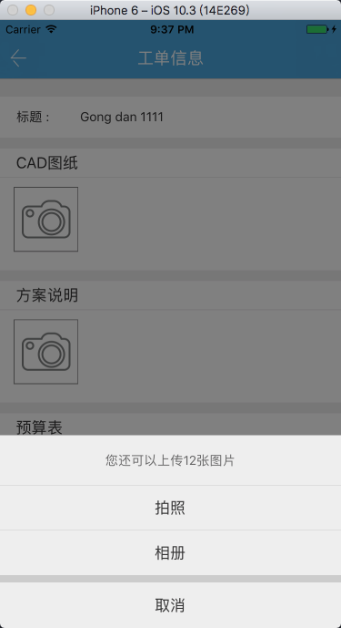
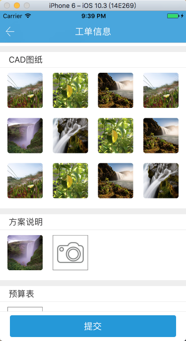
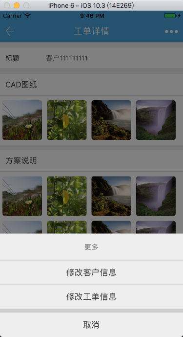
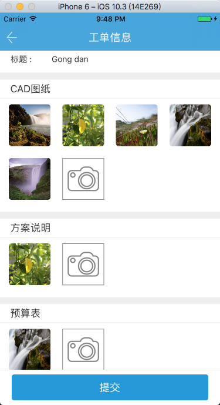

##0、色值##

主题色 RGB(36, 151, 216)

按钮按压时颜色 RGB(27, 126, 183)

##一、登录##

##二、注册##

##三、忘记密码##

##四、首页##
**4.1 无数据**

**4.2 有数据**

##五、设置##

**5.1 修改头像**

**5.2 修改姓名**

**5.3 修改密码**

**5.4 退出登录**

##六、添加工单##

**6.1**

**6.2 选择方式**

**6.3 相册选择**

**6.4 图片上传**

**6.5 图片预览**

**6.6 图片删除**

##七、工单详情##
**7.1 详情**

**7.2 图片预览**

**7.3 添加客户信息**

**7.4 详情-带客户信息**

**7.5 施工进度**

**7.6 完成进度**

**7.7 修改信息**

**7.8 修改客户信息**

**7.9 修改工单信息**

